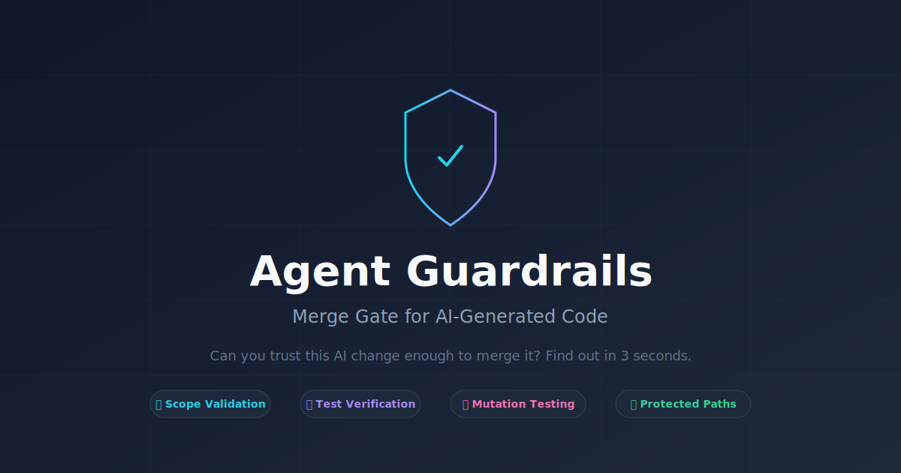
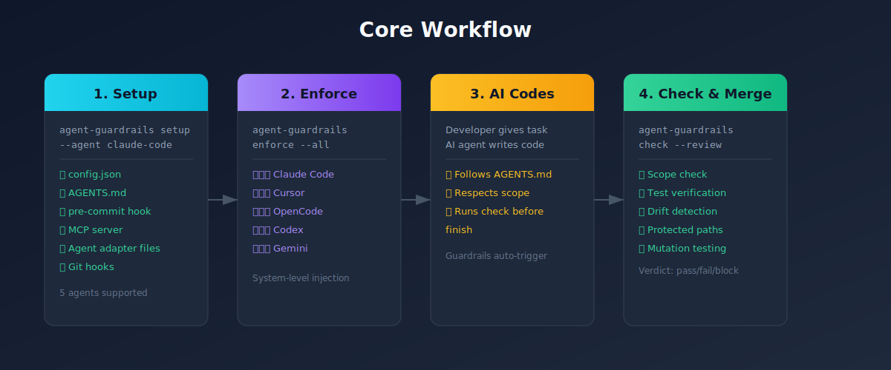
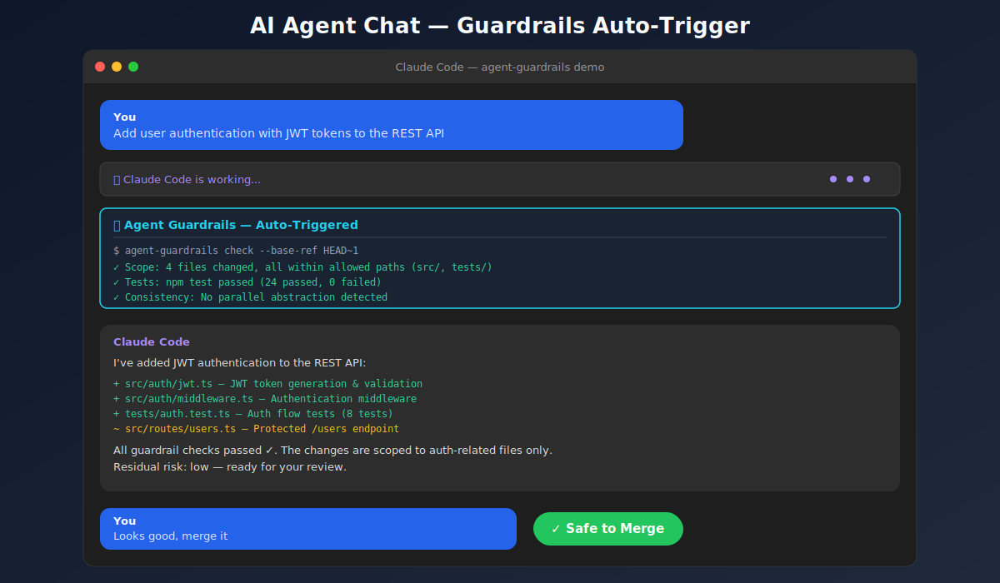
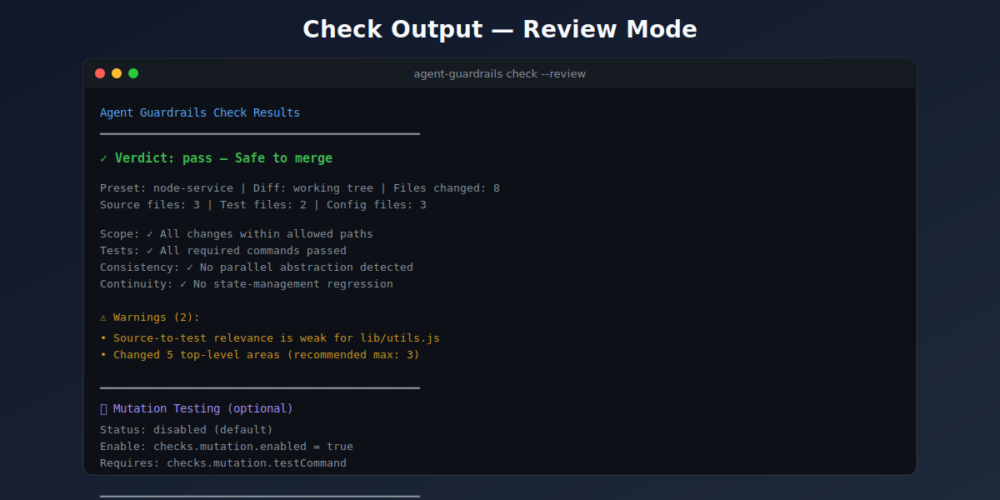

# Agent Guardrails

**[🇨🇳 中文版](./docs/zh-CN/README.md)** | **[🇬🇧 English](./README.md)**



`agent-guardrails` is a **merge gate for AI-generated code**. It checks that AI changes match expectations *before* you merge.

- 🎯 **Scope validation** — AI only touches allowed files
- ✅ **Test verification** — tests must pass
- 🔍 **Drift detection** — catches parallel abstractions, interface changes
- 🛡 **Protected paths** — critical files stay untouched
- 🔒 **Security hygiene** — warns on hardcoded secrets, unsafe patterns, sensitive file changes
- 📊 **Trust score** — 0-100 composite score with graduated verdicts
- 🔧 **Auto-fix** — Tier-1 issues fixed automatically, zero side effects
- 🧬 **Mutation testing** — optional lightweight built-in slice catches vacuous tests (config-gated, default-disabled)

## Who it is for

`agent-guardrails` is aimed first at **solo developers and small teams** already using AI coding tools.

- solo founders shipping real product code with Claude Code, Cursor, Codex, Gemini, or OpenCode
- small product teams that want the same repo guardrails even when each developer uses a different agent
- consultants and agencies that need safer AI-assisted changes across multiple client repos

It is **not** primarily for one-off toy prompts or teams looking to replace their coding agent entirely.

## Prerequisites

- **Node.js 18+**
- **Git** — your project must be a git repository (`git init`). All change detection relies on `git diff`.

## Quick Start

```bash
# 1. Install
npm install -g agent-guardrails

# 2. Set up in your project (must be a git repo)
cd your-repo
agent-guardrails setup --agent claude-code

# 3. Enforce rules (recommended)
agent-guardrails enforce --all
```

Supports 5 agents: `claude-code`, `cursor`, `opencode`, `codex`, `gemini`.

## How It Works



## Core Workflow

### 1. Setup — Initialize your project

```bash
agent-guardrails setup --agent <your-agent>
```

This automatically:
- ✅ Generates `.agent-guardrails/config.json`
- ✅ Generates/appends `AGENTS.md`
- ✅ Injects a git pre-commit hook
- ✅ Creates AI tool config files (MCP)

### 2. Enforce — Make AI follow the rules (recommended)

The `AGENTS.md` from `setup` is advisory. AI agents may ignore it. **`enforce` injects guardrail instructions directly into each agent's system-level auto-read files** (like `CLAUDE.md`, `GEMINI.md`), which take far higher priority.

```bash
# Enforce for all supported agents
agent-guardrails enforce --all

# Or a specific agent
agent-guardrails enforce --agent claude-code

# See which agents are supported
agent-guardrails enforce --help
```

| Agent | Injection file | Auto-read level |
|-------|---------------|-----------------|
| Claude Code | `CLAUDE.md` | ⭐⭐⭐ System |
| Cursor | `.cursor/rules/agent-guardrails-enforce.mdc` | ⭐⭐⭐ System |
| OpenCode | `.opencode/rules/agent-guardrails-enforce.md` | ⭐⭐⭐ System |
| Codex | `.codex/instructions.md` | ⭐⭐⭐ System |
| Gemini CLI | `GEMINI.md` | ⭐⭐⭐ System |

**Remove enforcement** (safely preserves your existing content):

```bash
agent-guardrails unenforce --all
agent-guardrails unenforce --agent claude-code
```

### 3. Daily workflow

After setup, the AI automatically runs checks before finishing tasks:

```bash
agent-guardrails check --base-ref HEAD~1
```

Results appear directly in the chat. The git pre-commit hook provides a safety net.





**Manual check (optional):**

```bash
agent-guardrails check --review
```

### 4. Plan a task (optional)

Keep the AI focused by creating a task contract first:

```bash
agent-guardrails plan --task "Add user authentication"
```

## Before vs After

| Before | After |
|--------|-------|
| "AI changed 47 files, no idea why" | "AI changed 3 files, all in scope" |
| "Tests probably passed?" | "Tests ran: 12 passed, 0 failed" |
| "That looks like a new pattern" | "⚠️ Parallel abstraction detected" |
| "Hope nothing breaks" | "✓ Safe to merge, residual risk: low" |

## Why this beats a DIY plugin stack

Many users already have Claude Code, Cursor, Codex, or Gemini plus custom prompts, hooks, and MCP tools.

The reason to use `agent-guardrails` is not that those tools cannot generate code.
It is that a DIY stack still leaves a lot of manual work around:

- defining repo-safe boundaries before implementation
- checking whether the diff stayed inside those boundaries
- proving validation actually ran
- summarizing residual risk for a human reviewer
- keeping repeated AI edits from slowly fragmenting the repo

`agent-guardrails` is strongest when users want to keep their current coding agent and add a repeatable trust layer on top.

## Three-layer Enforcement

| Layer | Mechanism | Effect |
|-------|-----------|--------|
| L1: enforce | Inject into agent system-level instruction files | ⭐⭐⭐ Strongest — auto-read by AI |
| L2: AGENTS.md | Project-level rule file | ⭐⭐ Medium — AI may ignore |
| L3: pre-commit hook | Git commit interception | ⭐⭐⭐ Safety net — enforced |

**Recommended**: `setup` + `enforce --all` = double protection.

## Competitor Comparison

| Feature | CodeRabbit | Sonar | agent-guardrails |
|---------|-----------|-------|------------------|
| Pre-generation constraints | ❌ Post-comment | ❌ Post-check | ✅ |
| Scope control | ❌ | ❌ | ✅ |
| Task context | ❌ | ❌ | ✅ |
| Test relevance checks | ❌ | ❌ | ✅ |

**Key difference**: define boundaries *before* code generation, not *after* discovering problems.

## Configuration

All settings live in `.agent-guardrails/config.json`, created by `setup`. Key sections:

### Scope (`checks.scope`)

Controls how out-of-scope file changes are handled.

```json
{
  "checks": {
    "scope": {
      "violationSeverity": "error",
      "violationBudget": 5
    }
  }
}
```

| Field | Default | Values | Description |
|-------|---------|--------|-------------|
| `violationSeverity` | `"error"` | `"error"` \| `"warning"` | Severity for scope violations. `"error"` blocks merge; `"warning"` lets acknowledged violations pass. |
| `violationBudget` | `5` | Number | Minor scope slips within this count are surfaced as soft warnings instead of hard errors. Only applies when explicit scope (allowedPaths, intendedFiles) is not configured. |

**Tip**: Keep `violationSeverity` at `"error"` (default) for safety-first workflows. Lower to `"warning"` only for exploratory prototyping where scope flexibility is acceptable.

### Consistency (`checks.consistency`)

| Field | Default | Description |
|-------|---------|-------------|
| `maxChangedFilesPerTask` | `20` | Maximum files per task before warning |
| `maxTopLevelEntries` | `3` | Maximum unique top-level directories |
| `maxBreadthMultiplier` | `2` | Breadth multiplier for change diffusion |

### Correctness (`checks.correctness`)

| Field | Default | Description |
|-------|---------|-------------|
| `requireTestsWithSourceChanges` | Preset-dependent | Require test file changes when source files change |
| `requireCommandsReported` | Preset-dependent | Require validation commands to be reported as run |
| `requireEvidenceFiles` | `true` | Require evidence file to exist |

### Scoring (`scoring`)

| Field | Default | Description |
|-------|---------|-------------|
| `weights` | Category defaults | Per-category weights (scope, validation, consistency, continuity, performance, risk), auto-normalized to 100 |

### Risk (`checks.risk`)

| Field | Default | Description |
|-------|---------|-------------|
| `requireReviewNotesForProtectedAreas` | `true` | Require review notes when touching protected paths |
| `warnOnInterfaceChangesWithoutContract` | `true` | Warn on interface changes not in task contract |
| `warnOnConfigOrMigrationChanges` | `true` | Warn on config/migration file changes |

## Pro (optional)

The OSS package is a complete merge gate. Pro is optional and only activates when the separate Pro package is installed and licensed.

**Check local Pro availability:**

```bash
agent-guardrails pro status
```

If Pro is absent or unlicensed, OSS behavior stays unchanged.

## CLI Reference

| Command | Purpose |
|---------|---------|
| `setup --agent <name>` | Initialize project |
| `enforce --all` | Enforce rules (recommended) |
| `unenforce --all` | Remove enforcement |
| `plan --task "..."` | Create task contract |
| `check --review` | Run reviewer-facing guardrail check |
| `generate-agents` | Generate agent-specific config files |
| `doctor` | Diagnose current installation |
| `pro status` | Show optional Pro install and license status |
| `pro cleanup` | Preview or apply Pro proof memory cleanup |
| `start` | Start daemon |
| `stop` | Stop daemon |
| `status` | Show daemon status |

## Install & Update

```bash
# Install
npm install -g agent-guardrails

# Update
npm update -g agent-guardrails
```

## Docs

- [CHANGELOG](./CHANGELOG.md)
- [User Guide](./docs/USER_GUIDE.md)
- [Troubleshooting](./docs/TROUBLESHOOTING.md)
- [Workflows](./docs/WORKFLOWS.md)

## License

MIT
