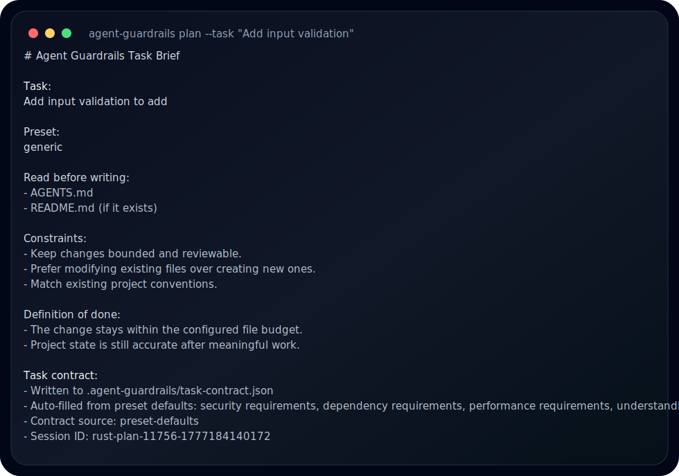
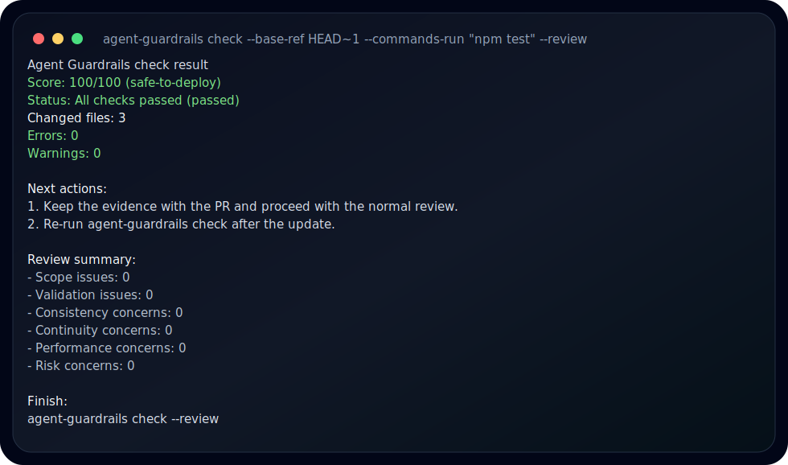

# Agent Guardrails

**[Chinese](./docs/zh-CN/README.md)** | **English**


`agent-guardrails` is a local safety layer for AI coding agents. It helps you turn a vague request into a bounded task, keeps the diff inside that boundary, and gives reviewers a clear answer before merge.

It does not replace Claude Code, Codex, Cursor, Gemini, or OpenCode. It works beside them as a repo-level guardrail.

## Why Use It

AI coding tools are fast, but the hard part is often the handoff:

- What exactly was the agent supposed to change?
- Did it touch files outside the task?
- Were tests or validation actually run?
- Is there evidence a reviewer can trust later?
- Did a small request turn into a broad rewrite?

`agent-guardrails` makes those questions explicit and repeatable.

## What It Checks

- Scope: flags changes outside the declared task, allowed paths, or intended files.
- Validation: checks reported commands and required evidence files.
- Consistency: warns when a task spreads across too many files or directories.
- Risk: surfaces protected paths, interface changes, config changes, migration changes, and secret-like patterns.
- Reviewer output: prints a score, verdict, findings, next actions, and a short review summary.
- Agent setup: writes repo-local helper files and MCP configuration guidance for supported agents.

## Supported Agents

`agent-guardrails` can generate or update helper files for:

| Agent | Helper location |
| --- | --- |
| Claude Code | `CLAUDE.md` |
| Codex | `.codex/instructions.md` |
| Cursor | `.cursor/rules/agent-guardrails-enforce.mdc` |
| Gemini CLI | `GEMINI.md` |
| OpenCode | `.opencode/rules/agent-guardrails-enforce.md` |

## Requirements

- Node.js 18+
- Git
- A git repository for the project you want to protect

The npm package includes native runtime binaries for Windows x64, macOS x64/arm64, and Linux x64. The Node runtime remains available as a fallback.

## Quick Start

```bash
npm install -g agent-guardrails

cd your-repo
agent-guardrails setup . --agent codex --lang en
agent-guardrails enforce --all --lang en
agent-guardrails doctor --lang en
```

Use the agent name you actually work with: `claude-code`, `codex`, `cursor`, `gemini`, or `opencode`.

## Core Workflow

1. Set up the repo once.
2. Ask your agent to use `agent-guardrails` for the task.
3. Create a task brief with `plan`, or let an MCP-capable agent start the guarded loop.
4. Implement the smallest safe change.
5. Run validation, then run `check --review` before merge.

```bash
agent-guardrails plan \
  --task "Add input validation" \
  --intended-files "src/add.js,tests/add.test.js" \
  --allow-paths "src/,tests/,evidence/" \
  --required-commands "npm test" \
  --evidence "evidence/add-validation.md" \
  --lang en
```



```bash
npm test
agent-guardrails check --base-ref HEAD~1 --commands-run "npm test" --review --lang en
```



The screenshots above were generated from `agent-guardrails@0.20.0` in a temporary git repository.

## MCP Integration

`setup` prints the MCP snippet for the selected agent. For Codex, the snippet looks like this:

```toml
[mcp_servers.agent-guardrails]
command = "npx"
args = ["agent-guardrails", "mcp"]
```

Once connected, MCP-capable agents can read repo guardrails, start a bounded implementation loop, check after edits, and finish with a review summary.

## Commands

| Command | Purpose |
| --- | --- |
| `setup . --agent <name>` | Initialize guardrails and agent helper files for a repo. |
| `enforce --all` | Add stronger guardrail instructions for all supported agents. |
| `unenforce --all` | Remove injected guardrail instructions. |
| `plan --task "..."` | Write a task contract before implementation. |
| `check --review` | Run a reviewer-facing guardrail check. |
| `doctor` | Diagnose repo setup and runtime availability. |
| `generate-agents` | Regenerate agent helper files. |
| `mcp` | Start the stdio MCP server. |
| `serve` | Start the local API service for integrations. |
| `start`, `stop`, `status` | Manage the local background daemon. |

## Configuration

`setup` creates `.agent-guardrails/config.json`. The most common settings are:

```json
{
  "checks": {
    "scope": {
      "violationSeverity": "error",
      "violationBudget": 5
    },
    "correctness": {
      "requireCommandsReported": true,
      "requireEvidenceFiles": true
    }
  }
}
```

Useful options:

| Setting | What it controls |
| --- | --- |
| `checks.scope.violationSeverity` | Whether scope violations are blocking errors or warnings. |
| `checks.scope.violationBudget` | How many minor scope slips can be treated as soft warnings. |
| `checks.consistency.maxChangedFilesPerTask` | File-count warning threshold for one task. |
| `checks.correctness.requireCommandsReported` | Whether validation commands must be reported. |
| `checks.correctness.requireEvidenceFiles` | Whether declared evidence files must exist. |
| `checks.risk.requireReviewNotesForProtectedAreas` | Whether protected areas need review notes. |

## Optional Pro Compatibility

The OSS package is usable on its own. It does not include Pro-only decision logic.

If a separately installed and licensed Pro package is present, the OSS CLI can surface Pro status and reports through:

```bash
agent-guardrails pro status
agent-guardrails pro activate <license-key>
agent-guardrails pro report
agent-guardrails pro workbench --open
```

If Pro is not installed or not licensed, normal OSS commands continue to work.

## Public Docs

- [CHANGELOG](./CHANGELOG.md)
- [Workflows](./docs/WORKFLOWS.md)
- [Troubleshooting](./docs/TROUBLESHOOTING.md)
- [Proof](./docs/PROOF.md)
- [Benchmarks](./docs/BENCHMARKS.md)

## License

MIT
