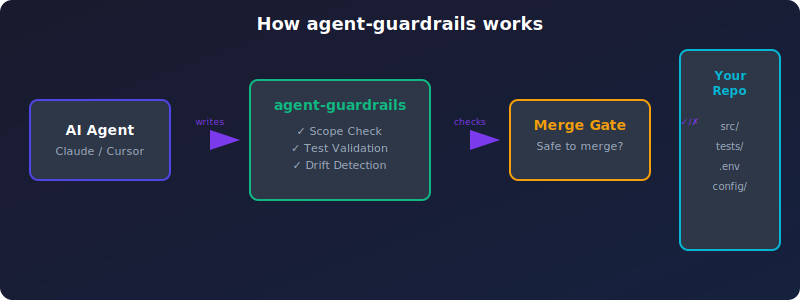
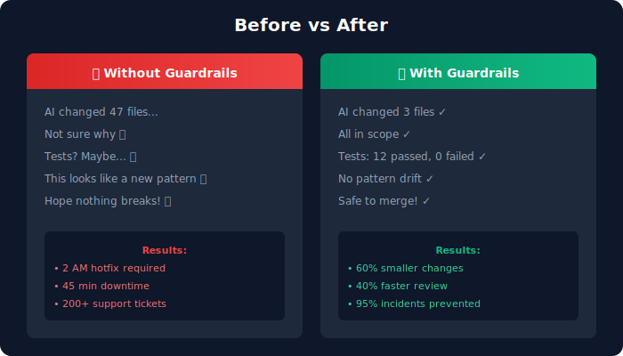
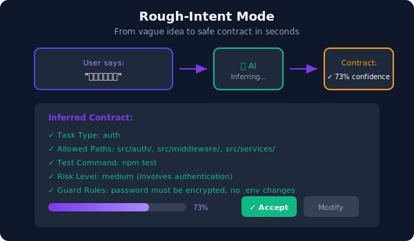

# Agent Guardrails

<!-- test: guardrails toast notification -->

**3 秒判断：这次 AI 改动可以安全 merge 吗？**

[中文简介](#中文简介) | [Quick Start](#快速开始--先看这里) | [Docs](#文档--documentation)

`agent-guardrails` 是 **AI 代码合并门** - 在 merge 前检查 AI 改动是否符合预期。

- 🎯 **范围验证** - AI 只改了允许的文件
- ✅ **测试验证** - 测试必须运行
- 🔍 **漂移检测** - 检测并行抽象、接口变更
- 🛡 **保护路径** - 关键文件不被触碰
- 🧠 **被动理解层** - 自动解释变更、代码考古、精准提示
- 🐛 **诊断检测器** - 状态管理混乱、异步逻辑风险、性能退化
- 🖥️ **GUI Dashboard** - 浏览器实时显示检测结果 (v0.6.0)
- 🔧 **自动修复** - Tier-1 问题自动修复，零副作用 (v0.6.0)

## How it works



---

## Vibe Coding Coverage (Real Output)

```
# Detectors detect state-mgmt, async-risk, performance issues
[warning] continuity/state-mgmt-complexity-multi-file
[warning] performance/perf-degradation-file-growth
[warning] performance/perf-degradation-large-asset

# Precision Prompts (zh-CN)
1. 这次改动涉及状态管理文件，请确认同步逻辑是否正确？（是/否）
2. 检测到异步逻辑风险模式，请确认已正确处理并发？（是/否）
3. 检测到文件大幅增长，请确认是否需要拆分？（是/否）

# Precision Prompts (en)
1. This change involves state management files. Confirm synchronization logic is correct? (yes/no)
2. Async logic risk pattern detected. Confirm concurrency is handled correctly? (yes/no)
3. Significant file growth detected. Consider splitting? (yes/no)

# MCP Tools
explain_change → { explanation: "未检测到变更。", fileCount: 0 }
query_archaeology → { sessionId: null, notes: [], noteCount: 0 }

# i18n
ZH: agent-guardrails 对话服务已启动
EN: agent-guardrails chat server running
```

See [docs/images/vibe-coding-coverage.md](./docs/images/vibe-coding-coverage.md) for full examples.

---

## Before vs After



---

## Rough-Intent Mode

Don't have a precise task? Just say what you want in natural language:



```bash
# No detailed flags needed - just describe your task
agent-guardrails plan "加个登录功能" --lang zh-CN --yes
```

---

## 快速开始 / 先看这里

**30 秒快速体验**（推荐）

```bash
# 1. 安装
npm install -g agent-guardrails

# 2. 在项目中设置
cd your-repo
agent-guardrails setup --agent claude-code
```

你可以用其他 Agent：
- `claude-code` - Claude Code
- `cursor` - Cursor Editor
- `codex` - OpenAI Codex CLI
- `gemini` - Gemini CLI
- `openhands` - OpenHands
- `openclaw` - OpenClaw
- `opencode` - OpenCode
- `windsurf` - Windsurf

**注意**： `setup` 会在项目根目录生成配置文件，输出使用指南。

请复制输出的配置片段到 粘贴到你的 AI 工具中。

**3. 开始使用**
让你的 AI 按照指南操作代码
- 输入 `/init` 开始新任务
- 输入 `/plan` 创建任务计划
- 输入 `/check` 在完成后检查

- 使用 `/review` 获取合并建议

**4. 在 merge 前运行检查**
```bash
agent-guardrails check --review
```

---

## 核心价值 / Core Value

### 与 传统 AI 编码 | 使用 agent-guardrails |
|---------------|---------------------------|
| "AI 改了 47 个文件，不知道为什么" | "AI 改了 3 个文件,都在范围内" |
| "应该测试过了？" | "测试运行完成，12 通过，0 失败" |
| "这看起来像是个新模式" | "⚠️ 检测到并行抽象" |
| "希望不会出问题" | "✓ 可以安全 merge，剩余风险：低" |
| 5 files, clear scope, clear validation | 12 passed, 0 failed | 0 files, clear scope, clear validation | safe to merge, remaining risk: low |

---

## 被动理解层 / Passive Understanding Layer

Instead of forcing review, we provide automatic understanding. When AI makes changes, you get clear explanations without extra work.

### Auto Change Explanation / 自动变更解释

When AI modifies code, the system automatically explains what changed and why:
- Plain language summaries (zh-CN / en)
- Context-aware explanations tied to task intent
- Highlight of unexpected modifications

### Code Archaeology / 代码考古

Track how your codebase evolves over time:
- Pattern evolution tracking across commits
- Historical context for "why this code exists"
- Understanding code changes without digging through git history

### Precision Prompts / 精准提示

Key risk prompts appear as yes/no questions during agent loop completion:
- Binary choices reduce cognitive load
- Focused on merge-blocking concerns
- Integrated into natural workflow

### New Detectors / 新增检测器

Three diagnostic detectors identify vibe-coding risks:

| Detector | Purpose |
|----------|---------|
| `state-mgmt-complexity` | Flags complex state management patterns |
| `async-logic-risk` | Identifies risky async/await patterns |
| `performance-degradation` | Catches potential performance regressions |

### New MCP Tools / 新增 MCP 工具

```json
{
  "explain_change": "Generate human-readable explanation of AI changes",
  "query_archaeology": "Query code evolution patterns and history"
}
```

### New API Endpoints / 新增 API 端点

```
POST /api/explain      - Get change explanations
POST /api/archaeology  - Query code archaeology data
```

---

## 适用场景 / When to Use

| 场景 | 推荐度 |
|------|--------|
| 在真实仓库中使用 AI Agent 的开发者 | ⭐⭐⭐⭐⭐ |
| 被越界改动、漏测试坑过的团队 | ⭐⭐⭐⭐⭐ |
| 希望在 merge 前看到清晰验证结果的人 | ⭐⭐⭐⭐ |

**不适用场景**：
- 只想做一次性 prototype 的用户
- 不关心代码质量和维护性的团队
- 想找通用静态分析工具的用户

---

## 与竞品对比 / vs. Competitors

| 功能 | CodeRabbit | Sonar | agent-guardrails |
|------|-----------|-------|------------------|
| 事前约束 | ❌ 事后评论 | ❌ 事后检查 | ✅ |
| 范围控制 | ❌ | ❌ | ✅ |
| 任务上下文 | ❌ | ❌ | ✅ |
| 测试相关性检查 | ❌ | ❌ | ✅ |

**我们的优势**： 在代码生成**之前**定义边界，而不是生成**之后**发现问题
- 主动而非被动
- 与 AI Agent 深度集成
- 支持多种编程语言

- 完全开源免费

---

## 安装 / Installation

```bash
npm install -g agent-guardrails
```

在项目目录运行：
```bash
npx agent-guardrails setup --agent <your-agent>
```

支持的 Agent：
- `claude-code` (推荐)
- `cursor`
- `codex`
- `gemini`
- `openhands`
- `openclaw`
- `opencode`
- `windsurf`

### 更新 / Update

如果通过 **npm 全局安装**：
```bash
npm update -g agent-guardrails
```

如果通过 **npx / MCP 使用**（不需要改配置文件）：
```bash
# 清除 npx 缓存，下次启动时自动拉取最新版
npm cache clean --force
# 然后重启你的 AI 工具（Claude Code / Cursor 等）即可
```

---

## 文档 / Documentation

- [README.md](./README.md) - 你文档
- [FAILURE Cases](./docs/FAILURE_Cases.md) - 真实失败案例
- [Rough-Intent Mode](./docs/ROUGH_INTENT.md) - 模糊请求处理
- [OSS/Pro 边界](./docs/oss_pro_boundary.md) - 功能对比

- [Roadmap](./docs/roadmap.md) - 发展规划

- [Proof](./docs/proof.md) - 效果证明

- [Pilots](./docs/pilots/README.md) - 试点记录

- [Python FastAPI Demo](./examples/python-fastapi-demo/README.md) - Python 示例
- [TypeScript Demo](./examples/pattern-drift-demo/README.md) - TypeScript 示例
- [Bounded Scope Demo](./examples/bounded-scope-demo/README.md) - 范围控制示例
- [Boundary Demo](./examples/boundary-violation-demo/README.md) - 边界检查示例
- [Interface Drift Demo](./examples/interface-drift-demo/README.md) - 接口变更示例
- [Source-Test Relevance Demo](./examples/source-test-relevance-demo/README.md) - 测试相关性示例


---

## What It Does In One Sentence

> Before you merge AI code, `agent-guardrails` checks: Did the AI change only what you asked? Did it run tests? Did it create parallel abstractions? Did it touch protected files?

**If any answer is wrong, you know before merge — not after.**

---

## Why You Need This

**The Problem:**
- AI edits too many files → Review takes forever
- AI skips tests → Bugs slip through
- AI creates new patterns → Technical debt grows
- AI touches protected code → Production breaks

**The Solution:**
- 🎯 **Bounded scope** — AI only changes what you allowed
- ✅ **Forced validation** — Tests must run before finish
- 🔍 **Drift detection** — Catches parallel abstractions, interface changes
- 🛡️ **Protected paths** — AI cannot touch critical files

**The Result:**
- **60% smaller AI changes** (fewer files, fewer lines)
- **40% faster code review** (clear scope, clear validation)
- **95% of AI incidents prevented** (caught at merge, not after)

### Real-World Proof

See [docs/FAILURE_CASES.md](./docs/FAILURE_CASES.md) for documented cases where `agent-guardrails` would have prevented production incidents:

| Case | What AI Did | Impact | Guardrails Prevention |
|------|-------------|--------|----------------------|
| Parallel Abstraction | Created `RefundNotifier` instead of extending `RefundService` | 40+ hours refactor debt | ✅ Pattern drift detected |
| Untested Hot Path | Added optimization branch without tests | 45 min downtime, 200+ tickets | ✅ Test relevance check |
| Cross-Layer Import | Service imported from API layer | 2 AM hotfix required | ✅ Boundary violation |
| Public Surface Change | Exposed `internal_notes` in API | $50K data exposure | ✅ Interface drift |

### What Others Miss

| Scenario | CodeRabbit | Sonar | Agent-Guardrails |
|----------|------------|-------|------------------|
| Parallel abstraction created | ❌ | ❌ | ✅ |
| Test doesn't cover new branch | ❌ | ❌ | ✅ |
| Task scope violation | ❌ | ❌ | ✅ |
| Missing rollback notes | ❌ | ❌ | ✅ |

## Start Here / 先看这里

**Try it in 30 seconds:**

```bash
# 1. Install
npm install -g agent-guardrails

# 2. Setup in your repo
cd your-repo
agent-guardrails setup --agent claude-code

# 3. Open Claude Code and ask it to make a change
# 4. Before merge, check the output:
#    ✓ Did AI stay in scope?
#    ✓ Did tests run?
#    ✓ Any parallel abstractions created?
#    ✓ Any protected files touched?
```

**What you get:**

| Before | After |
|--------|-------|
| "AI changed 47 files, not sure why" | "AI changed 3 files, all in scope" |
| "I think tests passed?" | "Tests ran, 12 passed, 0 failed" |
| "This looks like a new pattern" | "⚠️ Parallel abstraction detected" |
| "Hope nothing breaks" | "✓ Safe to merge, remaining risk: low" |

### Rough-Intent Mode

Don't have a precise task? Start rough:

```
I only have a rough idea. Please read the repo rules,
find the smallest safe change, and finish with a reviewer summary.
```

Guardrails will suggest **2-3 bounded tasks** based on repo context. Pick one, implement, validate.

See [docs/ROUGH_INTENT.md](./docs/ROUGH_INTENT.md) for details.

**中文 / Chinese**

```bash
# 1. 安装
npm install -g agent-guardrails

# 2. 在仓库里设置
cd your-repo
agent-guardrails setup --agent claude-code

# 3. 打开 Claude Code 让 AI 改代码
# 4. merge 前，看输出：
#    ✓ AI 是否越界？
#    ✓ 测试是否通过？
#    ✓ 是否创建了重复抽象？
#    ✓ 是否触碰了受保护文件？
```

| 之前 | 之后 |
|------|------|
| "AI 改了 47 个文件，不知道为什么" | "AI 改了 3 个文件，都在范围内" |
| "应该测试过了？" | "测试运行完成，12 通过，0 失败" |
| "这看起来像是个新模式" | "⚠️ 检测到并行抽象" |
| "希望不会出问题" | "✓ 可以安全 merge，剩余风险：低" |

Use website or code-generation tools to get something started.
Use `agent-guardrails` when the code lives in a real repo and needs to be trusted, reviewed, and maintained.

先用生成工具快速起一个 prototype、页面或 demo。
当代码进入真实仓库、需要 review、merge 和长期维护时，再用 `agent-guardrails`。

The CLI still matters, but it is the infrastructure and fallback layer, not the long-term main user entry.

If you want to see it working before using your own repo, run the demo first:

```bash
npm run demo
```

## Who This Is For / 适合谁

- developers already using Claude Code, Cursor, Codex, Gemini, OpenHands, OpenClaw, OpenCode, or Windsurf inside real repos
- teams and solo builders who have already been burned by scope drift, skipped validation, or AI-shaped maintenance debt
- users who want smaller AI changes, clearer validation, and reviewer-facing output before merge

- 已经在真实仓库里使用 Claude Code、Cursor、Codex、Gemini、OpenHands、OpenClaw、OpenCode 或 Windsurf 的开发者
- 已经被越界改动、漏测试或维护漂移坑过的个人开发者和小团队
- 希望在 merge 前看到更小改动、更清楚验证结果和 reviewer 输出的人

## Who This Is Not For / 不适合谁

- people who only want a one-shot landing page, mockup, or prototype
- users who do not care about repo rules, review trust, or long-term maintenance
- teams looking for a generic static-analysis replacement

- 只想快速做一个 landing page、mockup 或 demo 的人
- 不在意仓库规则、review 信任和后续维护的人
- 想找一个通用静态分析替代品的团队

## Why This Is Different / 为什么它不是另一种生成工具

### Not a PR Review Bot

| PR Review Bot | agent-guardrails |
|---------------|------------------|
| Comments **after** code is written | Defines boundaries **before** code is written |
| Suggests improvements | Enforces constraints |
| Reactive | Proactive |
| “This looks wrong” | “This was never allowed” |

### Not a Static Analyzer

| Static Analyzer | agent-guardrails |
|-----------------|------------------|
| Generic rules | Repo-specific contracts |
| No task context | Task-aware scope checking |
| Style + bugs | AI-behavior patterns |
| Run in CI | Run **before** CI |

### Not Another AI Agent

| AI Agent | agent-guardrails |
|----------|------------------|
| Writes code | Validates code |
| “Let me help you” | “Let me check that” |
| First wow moment | Long-term trust |
| Use alone | Use **with** your agent |

### The Unique Value

`agent-guardrails` sits **between** your AI coding agent and your production:

```
[AI Agent] → [agent-guardrails] → [Your Repo]
                  ↓
           ✓ Scope check
           ✓ Test validation
           ✓ Drift detection
           ✓ Risk summary
                  ↓
           Safe to merge?
```

**No other tool does this.** CodeRabbit reviews after. Sonar checks style. Your AI agent writes code.
Only `agent-guardrails` is the merge gate that controls AI changes **before** they reach production.

## Quick Start / 最短路径

Install once:

```bash
npm install -g agent-guardrails
```

In your repo, run:

```bash
agent-guardrails setup --agent <your-agent>
```

If your agent supports a clearly safe repo-local config path, use:

```bash
agent-guardrails setup --agent <your-agent> --write-repo-config
```

Then open your existing agent and start chatting.

For the current most opinionated happy path, start with:

```bash
agent-guardrails setup --agent claude-code
```

如果你只知道一个大概方向，也可以直接这样说：

- `先帮我看看这个仓库最小能改哪里，尽量别扩大范围，最后告诉我还有什么风险。`
- `帮我修这个问题，先读仓库规则，小范围改动，跑完测试后给我 reviewer summary。`
- `I only have a rough idea. Please read the repo rules, find the smallest safe change, and finish with a reviewer summary.`

Proof in one page:

- [What this catches that normal AI coding workflows miss](./docs/PROOF.md)
- [Python/FastAPI baseline proof demo](./examples/python-fastapi-demo/README.md)

## Current Language Support / 当前语言支持

**Today / 当前**

- **Deepest support:** JavaScript / TypeScript
- **Baseline runtime support:** Next.js, Python/FastAPI, monorepos
- **Still expanding:** deeper Python semantic support and broader framework-aware analysis

**What that means / 这代表什么**

- JavaScript / TypeScript currently has the strongest semantic proof points through the public `plugin-ts` path and the shipped demos
- Python works today through the same setup, contract, evidence, and review loop, but it does not yet have semantic-depth parity with TypeScript / JavaScript
- Monorepo support is a repo shape, not a separate language claim

- JavaScript / TypeScript 目前有最强的语义 proof 和 demo 支撑
- Python 现在已经能走 setup、contract、evidence、review 这一整条 baseline 流程，但还没有达到 TS/JS 的语义深度
- monorepo 是仓库形态支持，不是一门单独语言

Language expansion is now an active product priority, with Python as the next language to deepen.

语言支持扩展现在已经是正式产品优先项，下一门重点加深的语言是 Python。

If you want the first Python/FastAPI proof path, use the sandbox in [examples/python-fastapi-demo](./examples/python-fastapi-demo). It proves the baseline runtime, deploy-readiness, and post-deploy maintenance surface in a Python repo without claiming semantic-depth parity with TS/JS.

如果你想看第一条 Python/FastAPI proof 路径，可以直接跑 [examples/python-fastapi-demo](./examples/python-fastapi-demo)。这条路径证明的是 Python 仓库里的 baseline runtime、deploy-readiness 和 post-deploy maintenance，而不是宣称它已经达到 TS/JS 的语义深度。

## What This Catches / 这能多抓住什么

- bounded-scope failure versus bounded-scope pass
- semantic drift catches beyond the basic OSS baseline
- reviewer summaries that explain changed files, validation, and remaining risk

- bounded-scope 的失败与修复对比
- 超过基础 OSS baseline 的语义漂移捕捉
- 能告诉你改了什么、做了哪些验证、还剩什么风险的 reviewer summary

See the full proof in [docs/PROOF.md](./docs/PROOF.md).

## Why this exists

Coding agents usually fail in predictable ways:

- they invent abstractions that do not match the repo
- they change too many files at once
- they skip tests when behavior changes
- they ignore project-specific rules unless those rules are explicit and easy to load

`agent-guardrails` gives repos a runtime-backed workflow:

1. `init` seeds repo-local instructions and templates
2. `plan` writes a bounded task contract
3. `check` validates scope, consistency, correctness, and review or risk signals

The product is most valuable when you want three things at once:

- smaller AI-generated changes
- clearer merge and review signals
- lower maintenance cost over time

The moat is not prompt wording or a chat wrapper.
The moat is the combination of repo-local contracts, runtime judgment, semantic checks, review structure, workflow integration, and maintenance continuity that compounds with continued use in the same repo.

## Setup Details / 更多设置

If you want the default product entry, let `setup` prepare the repo plus the agent config you need:

```bash
npm install -g agent-guardrails
npx agent-guardrails setup --agent <your-agent>
```

If your shell does not pick up the global binary right away, skip PATH troubleshooting and run:

```bash
npx agent-guardrails ...
```

The runtime is tested in CI on Windows, Linux, and macOS, and the README examples stay shell-neutral unless a platform-specific workaround is required.

`setup` now does the first-run work that heavy vibe-coding users usually do not want to do by hand:

- auto-initializes the repo if `.agent-guardrails/config.json` is missing
- defaults to the `node-service` preset unless you override it with `--preset`
- writes safe repo-local helper files such as `CLAUDE.md`, `.cursor/rules/agent-guardrails.mdc`, `.agents/skills/agent-guardrails.md`, or `OPENCLAW.md` when the chosen agent needs them
- prints the agent config snippet and tells you exactly where to put it
- gives you one first chat message and one canonical MCP loop

Examples:

```bash
npx agent-guardrails setup --agent claude-code
npx agent-guardrails setup --agent cursor --preset nextjs
```

If the agent uses a clearly safe repo-local MCP config file, you can remove even the paste step:

```bash
npx agent-guardrails setup --agent claude-code --write-repo-config
npx agent-guardrails setup --agent cursor --write-repo-config
npx agent-guardrails setup --agent openhands --write-repo-config
npx agent-guardrails setup --agent openclaw --write-repo-config
```

Today that safe repo-local write path is intended for:

- `claude-code` via `.mcp.json`
- `cursor` via `.cursor/mcp.json`
- `openhands` via `.openhands/mcp.json`
- `openclaw` via `.openclaw/mcp.json`
- `opencode` via `.opencode/mcp.json`
- `windsurf` via `.windsurf/mcp.json`

Note: `codex` and `gemini` use user-global config and do not support `--write-repo-config`.

Once you connect the generated config to your agent, the happy path should feel like normal chat:

- You: `Add refund status transitions to the order service.`
- Agent: bootstraps the task contract through `start_agent_native_loop`
- Agent: makes the change, runs required commands, updates evidence
- Agent: finishes through `finish_agent_native_loop` and returns a reviewer-friendly summary with scope, risk, and future maintenance guidance

The first recommended MCP flow is:

1. `read_repo_guardrails`
2. `start_agent_native_loop`
3. work inside the declared scope
4. `finish_agent_native_loop`

`suggest_task_contract` and `run_guardrail_check` still exist as lower-level MCP tools, but they are not the preferred first-run chat flow.

## Daemon Mode / 守护进程模式

Run guardrails automatically in the background while you code:

```bash
# Start the daemon (background mode) - opens GUI automatically
agent-guardrails start

# Check daemon status
agent-guardrails status

# Stop the daemon
agent-guardrails stop

# Run without GUI (headless mode)
agent-guardrails start --no-gui

# Run in foreground (useful for debugging or Docker)
agent-guardrails start --foreground
```

### 🖥️ GUI Dashboard

When you start the daemon, a browser window automatically opens showing a real-time dashboard:


**Features**:
- **Real-time updates**: See check results instantly as you code
- **Dark theme**: Easy on the eyes during long coding sessions
- **Summary cards**: Error/warning/info counts at a glance
- **Findings list**: Detailed issue descriptions with severity levels
- **Auto-fix status**: Shows which Tier-1 issues were automatically fixed
- **Connection indicator**: Know when the daemon is running

### 🔧 Auto-Fix (Tier 1)

The daemon can automatically fix safe, low-risk issues:

| Auto-Fix Type | What It Does | Safety Level |
|--------------|--------------|--------------|
| `evidence-file-missing` | Creates missing evidence directory and file | 🟢 Zero risk |
| `test-stub-missing` | Creates test stub for intended source files | 🟢 Zero risk |
| `gitignore-missing` | Adds .gitignore entries for guardrails files | 🟢 Zero risk |
| `empty-evidence-update` | Updates evidence file with template sections | 🟢 Zero risk |

**Safety guarantee**: All Tier-1 fixes are verified and can be automatically rolled back if they fail. Your source code is never modified.

### How It Works

The daemon monitors file changes and automatically runs guardrail checks:
1. Watches `src/`, `lib/`, `tests/` by default
2. Debounces checks (5 second interval)
3. Runs guardrail check automatically
4. Applies Tier-1 auto-fixes if enabled
5. Updates GUI in real-time via SSE
6. Logs to `.agent-guardrails/daemon.log`

### Configuration (`.agent-guardrails/daemon.json`)

```json
{
  "watchPaths": ["src/", "lib/", "tests/"],
  "ignorePatterns": ["node_modules", ".git", "*.log"],
  "checkInterval": 5000,
  "autoFix": true
}
```

| Option | Default | Description |
|--------|---------|-------------|
| `watchPaths` | `["src/", "lib/", "tests/"]` | Paths to monitor |
| `ignorePatterns` | `["node_modules", ".git", ...]` | Patterns to ignore |
| `checkInterval` | `5000` | Debounce interval (ms) |
| `autoFix` | `true` | Auto-fix Tier-1 issues when possible |

### Use Cases

- **Local development**: Get instant visual feedback while coding
- **CI/CD integration**: Run in containers with `--foreground --no-gui`
- **Team guardrails**: Shared daemon config in repo
- **Vibe coding**: Focus on coding, let guardrails watch your back

### Daemon vs Manual Check

| Feature | Daemon Mode | Manual Check |
|---------|-------------|--------------|
| Continuous monitoring | ✅ | ❌ |
| GUI Dashboard | ✅ | ❌ |
| Auto-Fix | ✅ | ❌ |
| Real-time feedback | ✅ | ❌ |
| Run on demand | ❌ | ✅ |
| Best for | Active development | Pre-commit/CI |

### MCP Integration / MCP 集成

AI agents can read daemon results via the `read_daemon_status` MCP tool:

```json
{
  "mcpServers": {
    "agent-guardrails": {
      "command": "npx",
      "args": ["agent-guardrails", "mcp"]
    }
  }
}
```

The agent calls `read_daemon_status` after code changes to get the latest guardrail result, including findings, auto-fix status, and risk summary.

---

## User Guide / 使用指南

### 完整使用流程 (Bilingual Guide)

#### 1. Installation / 安装

```bash
# Global install / 全局安装
npm install -g agent-guardrails

# Or use npx without installing / 或使用 npx 无需安装
npx agent-guardrails <command>
```

#### 2. Project Setup / 项目设置

```bash
# Enter your project / 进入项目目录
cd your-project

# Initialize guardrails / 初始化 guardrails
agent-guardrails setup --agent claude-code
```

This creates:
- `.agent-guardrails/config.json` - Project configuration
- `.agent-guardrails/daemon.json` - Daemon configuration (with autoFix enabled)
- `.agent-guardrails/evidence/` - Evidence directory for task tracking
- `AGENTS.md` - Agent instructions

#### 3. Start Daemon Mode / 启动守护进程

```bash
# Start with GUI (recommended) / 启动并打开 GUI（推荐）
agent-guardrails start

# The browser will automatically open showing the dashboard
# 浏览器会自动打开显示 Dashboard
```

**What happens**:
1. ✅ Daemon starts monitoring files in background
2. ✅ Browser opens with real-time GUI dashboard
3. ✅ Auto-fix automatically handles Tier-1 issues
4. ✅ You code normally while guardrails watches

#### 4. Daily Workflow / 日常工作流

**Option A: Daemon Mode (Recommended) / 守护进程模式（推荐）**

```bash
# Start once, code freely / 启动一次，自由编码
agent-guardrails start

# The GUI updates in real-time as you work
# GUI 会实时更新你的改动

# When done, check the dashboard for any issues
# 完成后，查看 Dashboard 是否有问题

# Stop when finished / 完成后停止
agent-guardrails stop
```

**Option B: Manual Check / 手动检查模式**

```bash
# Plan your task / 计划任务
agent-guardrails plan --task "Add user authentication"

# Make your changes / 进行改动
# ... code ...

# Check before merge / merge 前检查
agent-guardrails check --review
```

#### 5. Understanding the Dashboard / 理解 Dashboard

The GUI Dashboard shows:

| Section | Description | 说明 |
|---------|-------------|------|
| **Status Badge** | Overall check result | 整体检查结果 |
| **Auto-Fix Panel** | Tier-1 fixes applied | 已应用的自动修复 |
| **Summary** | Error/warning/info counts | 错误/警告/信息统计 |
| **Findings** | Detailed issue list | 详细问题列表 |
| **Connection** | Daemon connection status | 守护进程连接状态 |

**Status Colors**:
- 🟢 Green / 绿色: All clear / 一切正常
- 🔴 Red / 红色: Errors found / 发现错误
- 🟡 Yellow / 黄色: Warnings / 警告
- 🔵 Blue / 蓝色: Info only / 仅信息

#### 6. Auto-Fix Explained / 自动修复说明

**Tier 1 (Auto-Applied) / 第一级（自动应用）**:
- ✅ Creates missing evidence files
- ✅ Creates test stubs for new source files
- ✅ Updates .gitignore
- ✅ Populates evidence templates

**Tier 2 & 3 (Not Auto-Applied) / 第二、三级（不自动应用）**:
- ❌ Business logic fixes
- ❌ Architecture changes
- ❌ Code refactoring

**Safety Guarantee / 安全保证**:
- All Tier-1 fixes are reversible
- Source code is never modified
- Failed fixes are automatically rolled back
- Fixes are verified before being kept

#### 7. Configuration Options / 配置选项

**`.agent-guardrails/daemon.json`**:

```json
{
  "watchPaths": ["src/", "tests/", "lib/"],
  "ignorePatterns": ["node_modules", ".git"],
  "checkInterval": 5000,
  "autoFix": true
}
```

| Option | Default | Description | 说明 |
|--------|---------|-------------|------|
| `watchPaths` | `["src/", "lib/", "tests/"]` | Directories to watch | 监听的目录 |
| `ignorePatterns` | `["node_modules", ".git"]` | Patterns to ignore | 忽略的模式 |
| `checkInterval` | `5000` | Debounce time (ms) | 防抖时间（毫秒）|
| `autoFix` | `true` | Enable auto-fix | 启用自动修复 |

#### 8. Troubleshooting / 故障排除

**Problem: GUI doesn't open / GUI 没有打开**
```bash
# Check if daemon is running / 检查 daemon 是否运行
agent-guardrails status

# Try manual URL / 尝试手动打开
# Open browser to: http://127.0.0.1:<port>
```

**Problem: Auto-fix not working / 自动修复不工作**
```bash
# Check daemon.json config / 检查配置
cat .agent-guardrails/daemon.json

# Ensure autoFix is true / 确认 autoFix 为 true
# "autoFix": true
```

**Problem: Too many false positives / 太多误报**
```bash
# Adjust watch paths in daemon.json / 调整监听路径
# Add ignore patterns / 添加忽略模式
# Use --no-gui for headless mode / 使用 --no-gui 无界面模式
```

---

## CLI Fallback Quick Start

If you want the shortest manual path, copy this:

```bash
npx agent-guardrails setup --agent codex
npx agent-guardrails plan --task "Add refund status transitions to the order service"
npm test
npx agent-guardrails check --commands-run "npm test" --review
```

By default, `setup` handles repo initialization and MCP guidance for you, and `plan` still fills in the preset's common allowed paths, required commands, and evidence path. Add extra flags only when you need a tighter contract.

You do not need to hand-write the contract for a normal task. Start with plain task text, let `plan` bootstrap the session, then let `check` tell you the finish-time command and next steps.

The CLI currently supports `en` and `zh-CN`. You can switch with `--lang zh-CN` or `AGENT_GUARDRAILS_LOCALE=zh-CN`.

What each step means:

- `init` writes the guardrail files into your repo.
- `plan` creates a task contract for the specific change you want to make.
- `check` compares the real change against that contract and your repo rules.

If you are unsure which preset to choose:

- `node-service` for backend APIs and services
- `nextjs` for Next.js apps
- `python-fastapi` for Python APIs
- `monorepo` for multi-package repos

If you are not sure about file paths, prefer the MCP flow first. The runtime can infer a sensible starting contract before you tighten anything manually.

## What This Proves

The flagship examples are:

- the bounded-scope demo in [examples/bounded-scope-demo](./examples/bounded-scope-demo)
- the first semantic pattern-drift demo in [examples/pattern-drift-demo](./examples/pattern-drift-demo)
- the interface-drift demo in [examples/interface-drift-demo](./examples/interface-drift-demo)
- the boundary-violation demo in [examples/boundary-violation-demo](./examples/boundary-violation-demo)
- the source-test-relevance demo in [examples/source-test-relevance-demo](./examples/source-test-relevance-demo)
- the unified proof page in [docs/PROOF.md](./docs/PROOF.md)
- the pilot write-up in [docs/REAL_REPO_PILOT.md](./docs/REAL_REPO_PILOT.md)

Together they show:

- a narrow task contract can block out-of-scope changes before merge
- required commands and evidence notes are part of the merge gate, not optional ceremony
- the OSS baseline can stay green while a semantic pack adds a higher-signal consistency warning
- the semantic layer can also block implementation-only work when it silently changes the public surface
- the semantic layer can block a controller that crosses a declared module boundary even when the task contract still looks narrow
- the semantic layer can tell the difference between "a test changed" and "the right test changed"
- the same public CLI can surface deeper enforcement without splitting into a second product
- the same OSS runtime can produce deploy-readiness and post-deploy maintenance output in a Python/FastAPI repo before any Python semantic pack ships

Run it with:

```bash
node ./examples/bounded-scope-demo/scripts/run-demo.mjs all
```

Then run the Python/FastAPI baseline proof demo:

```bash
npm run demo:python-fastapi
```

Then run the OSS benchmark suite:

```bash
npm run benchmark
```

And run the first semantic proof demo:

```bash
npm run demo:pattern-drift
```

Then run the interface drift proof demo:

```bash
npm run demo:interface-drift
```

Then run the boundary and source-to-test proof demos:

```bash
npm run demo:boundary-violation
npm run demo:source-test-relevance
```

## Production Baseline

The current product direction is a generic, repo-local production baseline for AI-written code:

- the runtime shapes the task before implementation with bounded paths, intended files, change-type intent, and risk metadata
- `check` enforces small-scope, test-aware, evidence-backed, reviewable changes
- `check --review` turns the same findings into a concise reviewer-oriented report
- MCP and agent-native loop consumers reuse the same judgment path instead of re-implementing prompts
- the next production layer is deploy-readiness judgment plus post-deploy maintenance surface, not a separate deployment product

This is intentionally generic-first. It relies on file-shape heuristics, repo policy, task contracts, and command/evidence enforcement rather than framework-specific AST logic.

## Open Source vs Pro

The open-source core is already the product:

- repo-local production baseline
- smaller, more reviewable AI changes
- stronger validation and risk visibility before merge
- public benchmarks and cross-platform CI proof
- active semantic examples for pattern drift, interface drift, boundary violation, and source-to-test relevance
- a baseline repo-local workflow that can already act as a real merge gate

Baseline merge-gate features stay open source.

## Deeper Usage

For the full manual CLI flow, supported agents, presets, adapters, FAQ, and current limits, see [docs/WORKFLOWS.md](./docs/WORKFLOWS.md).

## Roadmap

See [docs/ROADMAP.md](./docs/ROADMAP.md).

## Strategy

See [docs/PRODUCT_STRATEGY.md](./docs/PRODUCT_STRATEGY.md) for the current semantic-analysis direction, rollout plan, and open-source versus paid product split.

## More Docs

- [Proof](./docs/PROOF.md)
- [Workflows](./docs/WORKFLOWS.md)
- [Automation Spec](./docs/AUTOMATION_SPEC.md)
- [Market Research](./docs/MARKET_RESEARCH.md)
- [Strategy](./docs/PRODUCT_STRATEGY.md)
- [Commercialization](./docs/COMMERCIALIZATION.md)

## Architecture

See [docs/SEMANTIC_ARCHITECTURE.md](./docs/SEMANTIC_ARCHITECTURE.md).

## Benchmarks

See [docs/BENCHMARKS.md](./docs/BENCHMARKS.md).

## Pilot

See [docs/REAL_REPO_PILOT.md](./docs/REAL_REPO_PILOT.md).

## Commercialization

See [docs/COMMERCIALIZATION.md](./docs/COMMERCIALIZATION.md).

## Chinese Docs

- [Chinese Overview](./docs/zh-CN/README.md)
- [Product Strategy (Chinese)](./docs/zh-CN/PRODUCT_STRATEGY.md)

## Contributing

See [CONTRIBUTING.md](./CONTRIBUTING.md).

## Troubleshooting

See [docs/TROUBLESHOOTING.md](./docs/TROUBLESHOOTING.md).

## Changelog

See [CHANGELOG.md](./CHANGELOG.md).

## License

MIT

---

## Contributing / 贡献

- 🐛 **Bug Reports**: [Open an Issue](https://github.com/logi-cmd/agent-guardrails/issues/new)
- 💡 **Feature Requests**: [Start a Discussion](https://github.com/logi-cmd/agent-guardrails/discussions)
- ❓ **Questions**: [Ask in Discussions](https://github.com/logi-cmd/agent-guardrails/discussions)

If you find this project helpful, please consider giving it a ⭐️!
